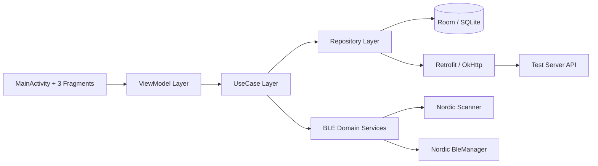
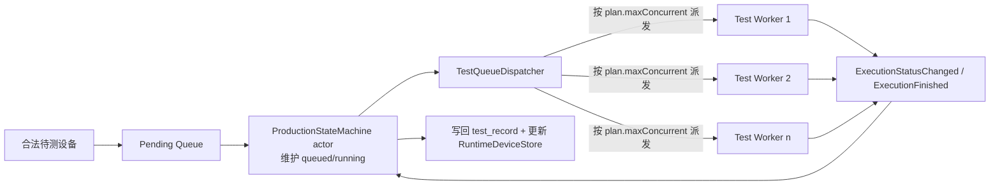
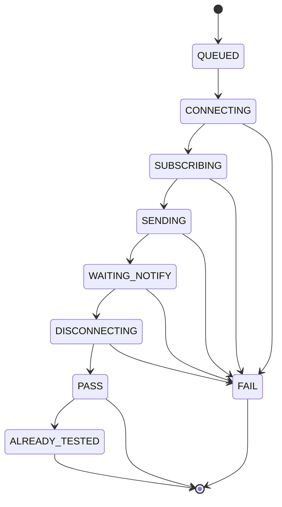
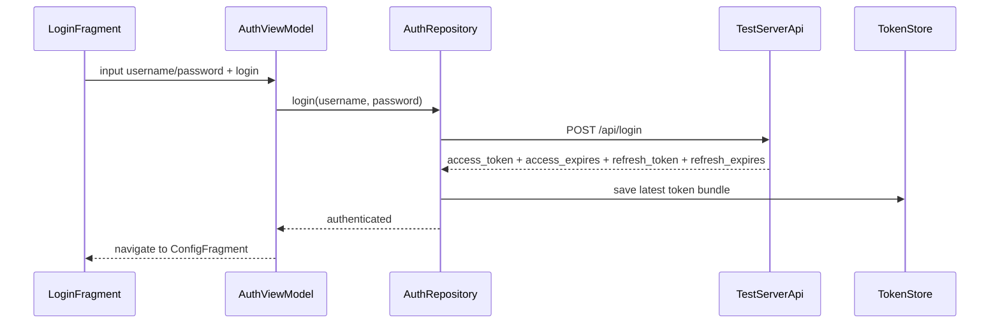
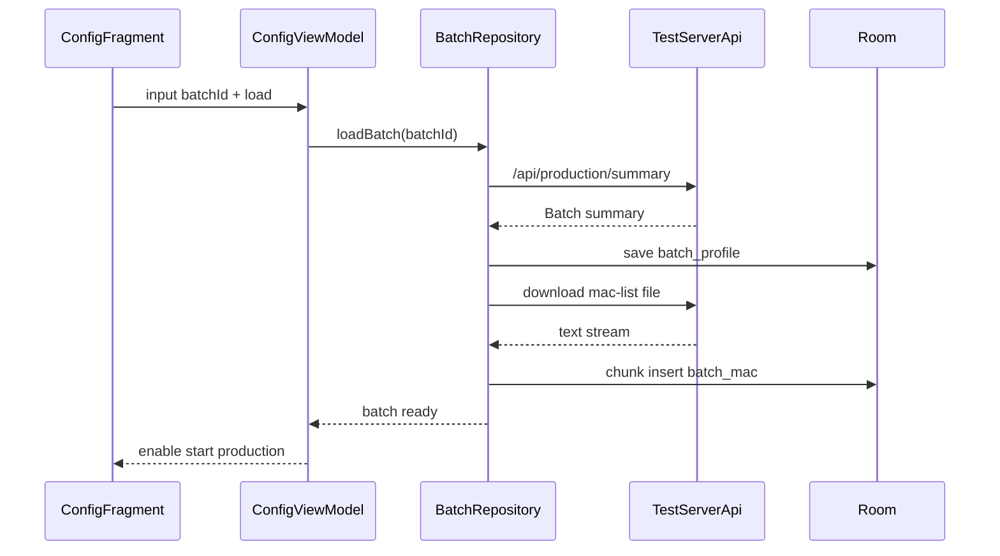
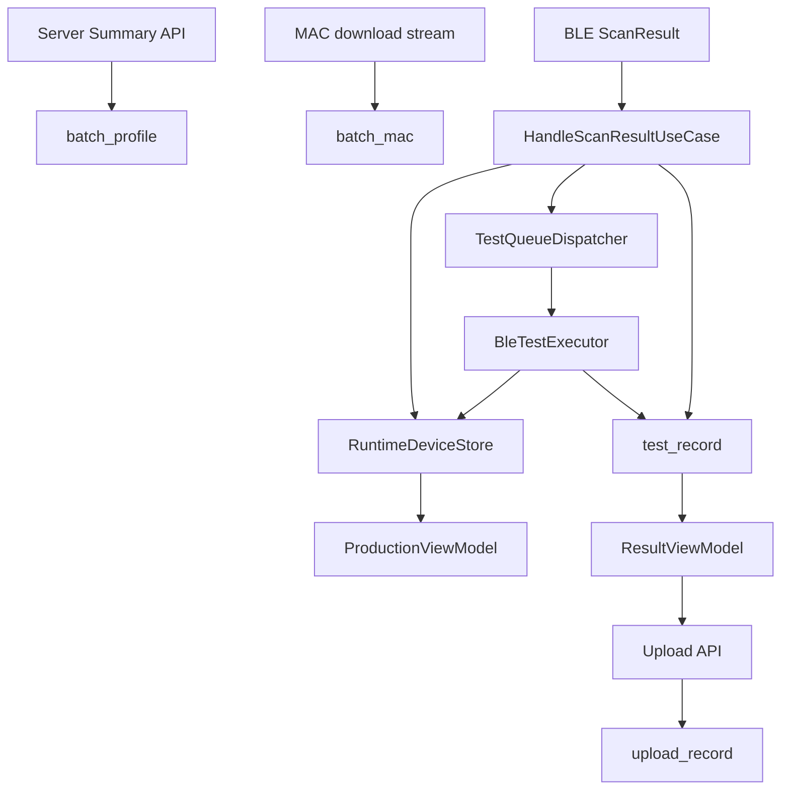

# Android 产测 App 架构设计

## 1. 文档目标

本文基于 [需求.md](需求.md) 和 [接口文档.md](接口文档.md) 设计 Android 产测 App 的可落地架构，目标是：

- 支持单工位 BLE 产测。
- 支持从云端拉取批次配置和超大规模 MAC 白名单。
- 支持持续扫描、合法性判定、排队测试、结果落库、统计展示、手动上报。
- 保证 UI 可观察、数据可恢复、现场可稳定运行。
- 输出 AI 或工程师可继续直接实现的模块划分、数据流、状态流和函数原型。

本文默认沿用当前工程形态：`Single-Activity + XML + Fragment + ViewModel + LiveData + Room + Retrofit + OkHttp + Nordic BLE`。

## 2. 范围与关键假设

### 2.1 已确认范围

- 页面结构为 `登录页 + 3 个业务页`：登录页、配置页、产测页、结果页；底部导航只覆盖后 3 个业务页。
- 使用 Room/SQLite 保存本地数据。
- ViewModel 管理页面状态，UI 通过 LiveData 观察。
- BLE 使用 Nordic `ble` 与 `scanner` 库。
- 单工位，但可同时连接多个设备，测试并发数由服务端配置控制。
- BLE 并发策略保持简单：客户端直接按服务端下发的 `maxConcurrent` 调度，不额外引入手机能力探测或自动降级。
- 结果上报为“当前本次产测会话”的结果，不是整个批次最终结果。

### 2.2 关键假设

- 服务端 `ble_config` 当前源码不会逐字段校验其内部结构，而是原样下发；客户端必须自行做字段归一化与兜底校验。
- `factory_id` 为结果上报必填字段，但需求文档未说明来源，因此设计为“配置页持久化输入”。
- 广播名称中的 `mac` 是业务判定身份，`BluetoothDevice.address` 仅用于连接，二者必须分离建模。
- “已产测”定义为：同一 `batch_id` 下该 MAC 在本地历史会话中已有最终测试记录，不再重复进入测试流程。

### 2.3 关键技术决策

1. 使用 `batch/<batch_id>/MAC 白名单` 的“流式下载 + 分块导入 + BloomFilter 预判 + LRU 热点缓存 + SQLite 精确匹配”链路，避免把几十万条 MAC 常驻内存，同时避免在高频扫描下每次都直查 SQLite。
2. 使用 `Long` 保存标准化 MAC，而不是 `String`。
3. 使用 `生产会话 session` 概念隔离“本次扫描/本次上报”和“历史已产测记录”。
4. 使用“扫描无限制 + 测试排队 + 固定并发门控”模型，满足“扫描设备不限，但连接数有限”。
5. 使用“插入顺序号 `sequence_no`”保证 UI 自上而下顺序显示且不重排。
6. `scan_idle` / `scan_active` 是服务端下发给 App 的扫描启停调度参数，不是 Android BLE 底层扫描参数；客户端通过 App 层调度器按这两个时长控制“开始扫描/停止扫描”。
7. 扫描调度与具体产测并行执行；DUT 在产测过程中需要在 UI 上持续显示步骤状态，测试结束后显示最终结果 `PASS/FAIL`，只有超出窗口后再次出现才转入“已产测再次出现”判定。

### 2.4 服务端源码确认后的真实约束

以下约束来自 `D:\test\py\test-server\app.py` 和真实批次样例，不再属于“推测”，客户端必须按硬约束处理：

1. `batch_id` 必须满足 `secure_filename(batch_id) == batch_id`，否则服务端直接视为非法。
2. 服务端批次目录必须严格命名为 `batch/<batch_id>/<batch_id>_mac_list.txt` 与 `batch/<batch_id>/<batch_id>_config.json`。
3. `ble_name_prefix` 在客户端应被视为服务端给定的完整前缀字符串；本地只校验其非空与可用性，不额外强制 `-` 或 `_` 规则。
4. `/api/production/result/upload` 实际必填字段除了文档中的字段外，还包括 `report_id` 和 `report_digest`。
5. 结果上传幂等键是 `batch_id + factory_id + report_digest`。同一组合重复上传时，服务端返回 `duplicate = true`，不会重复落盘。
6. 服务端落盘文件名完全由 `report_id` 经过 `secure_filename` 后生成，因此客户端必须保证 `report_id` 安全且稳定。
7. `/api/production/statistics` 只会读取 `result/` 目录下文件名以 `<batch_id>_` 开头、以 `.json` 结尾的最新文件。
8. 因为第 6 条和第 7 条同时存在，客户端必须保证 `report_id` 以 `<batch_id>_` 开头，否则上传虽然成功，但统计接口可能读不到。
9. 服务端对 `success_records`、`fail_records`、`invalid` 只校验基础结构，不校验 MAC 格式和 digest 算法，因此客户端必须自校验。
10. 服务端当前 token 黑名单和活跃 token 状态只保存在内存中，服务重启后会丢失；客户端不得把“服务端持久记忆”当成设计前提。

## 3. 总体架构



### 3.1 当前实现快照（2026-04-14）

经过前几轮重构，产测主链路已经从“扫描回调里夹带业务编排”收敛为“协调器 + 单线程状态机 + 执行器”的结构，当前代码口径如下：

1. `ProductionRepository` 仍然作为旧 UI 的 facade 存在，但职责已经明显收缩为：
   - 暴露 `config / production / result / shell` 四组 `LiveData`
   - 转发开始产测、停止产测、上传结果
   - 拼装当前页面所需的 UI 状态
2. 启动前环境校验已拆到 `ValidateProductionStartUseCase`：
   - 校验批次是否已加载
   - 校验广播名前缀是否有效
   - 校验蓝牙权限、蓝牙开关、定位开关
   - 产出 `batch / prefix / staleTimeoutMs`
3. session 生命周期已拆到 `ProductionSessionCoordinator`：
   - 负责 `startSession / stopSession`
   - 负责串起 `SessionRepository / ScanScheduler / ProductionStateMachine / TestQueueDispatcher`
   - 启动时先停旧会话、清运行时缓存、建 session、再启动状态机/队列/扫描
4. `ProductionStateMachine` 已演进为 actor / event loop 模型：
   - 扫描事件、BLE 进度事件、BLE 完成事件、清理事件全部进入统一事件流
   - 通过单线程串行消费，避免扫描回调、BLE 回调、UI 线程同时改状态
   - 内部统一负责“合法/非法/已测/入队/执行中/最终态/列表消失”判定
5. `queueState`、`queuedMacs`、`runningMacs` 已经并入状态机 actor：
   - `TestQueueDispatcher` 不再维护自己的排队状态
   - dispatcher 只保留并发门控（`Semaphore`）和真正的 BLE 执行
6. `RuntimeDeviceStore` 已被压成纯显示缓存：
   - 只提供 `save / find / remove / clear / snapshot / observeVisibleDevices`
   - 不再承担“状态推导”职责
7. BLE 失败原因已经结构化：
   - `BleFailureReason` 明确区分 `CONNECT_FAILED / SUBSCRIBE_FAILED / WRITE_FAILED / ...`
   - 重试策略固定为 3 次，仅连接失败、订阅失败、发送失败可重试
8. “已产测”判定已经收紧为只认最终结果：
   - `hasFinalRecord(batchId, parsedMac)` 只认 `PASS / FAIL`
   - `INVALID_DEVICE` 不参与“已产测”判断
9. 广播名解析已收紧为：
   - `startsWith(prefix)`
   - 前缀后必须是 12 位大写十六进制 MAC
   - 不再要求客户端写死 `-` 或 `_` 规则
10. 产测统计语义已明确为“当前 session 累计统计”，不是“当前可见列表统计”：
   - 点击“开始产测”时，清空上一次统计并创建新的 session
   - 点击“停止产测”时，不清空本次统计，只停止继续增长
   - 结果页的会话统计与产测页实时统计是同一份 session 数据
   - 统计数据应来自本地持久化记录，App 崩溃或重启后，只要没有重新开始新 session，就继续显示上一次 session 的统计
   - `RuntimeDeviceStore` 只负责当前列表显示，不能作为 session 统计事实来源

这意味着当前真正的运行链路已经是：

`ProductionFragment/ViewModel -> ProductionRepository(facade) -> ValidateProductionStartUseCase -> ProductionSessionCoordinator -> ScanScheduler / TestQueueDispatcher / ProductionStateMachine(actor) -> RuntimeDeviceStore + Room`

## 4. 分层设计

### 4.1 UI 层

- `MainActivity`
  - 承载 `NavHostFragment`
  - 未登录时进入登录流；已登录后进入 `BottomNavigationView + 业务 NavGraph`
  - 根据 `SessionState` 控制是否允许切页
- `LoginFragment`
  - 输入账号密码
  - 发起登录
  - 展示登录中、登录失败、token 失效后重新登录等状态
- `ConfigFragment`
  - 输入 `batchId`
  - 拉取批次摘要
  - 下载并导入 MAC 列表
  - 配置 `factoryId`
- `ProductionFragment`
  - 启动/停止产测
  - 展示扫描列表、设备状态、实时统计
  - 实时统计显示的是“当前 session 累计统计”，不是“当前还留在列表里的 DUT 统计”
- `ResultFragment`
  - 展示当前会话统计
  - 当前会话统计与产测页实时统计使用同一份 session 数据
  - 手动上报结果
  - 查看上报状态

### 4.2 ViewModel 层

- `AuthViewModel`
  - 登录状态
  - token 失效跳转控制
  - access / refresh 过期时间管理
  - 刷新中状态与全局登出事件
- `ConfigViewModel`
  - 批次加载流程
  - 导入进度、错误、配置就绪态
- `ProductionViewModel`
  - 当前会话状态
  - 设备列表
  - 统计信息
  - 启停按钮可用性
- `ResultViewModel`
  - 当前会话汇总
  - 上传进度
  - 上传结果
- `SharedSessionViewModel`
  - 当前激活批次
  - 当前会话 ID
  - 导航锁状态

### 4.3 Domain / UseCase 层

- `LoginUseCase`
- `LoadBatchSummaryUseCase`
- `DownloadAndImportMacListUseCase`
- `RestoreConfigStateUseCase`
- `RestoreResultStateUseCase`
- `ValidateProductionStartUseCase`
- `BuildSessionReportUseCase`
- `UploadSessionReportUseCase`
- `ProductionSessionCoordinator`
- `ProductionStateMachine`

说明：

- 早期设计里的 `StartProductionSessionUseCase / StopProductionSessionUseCase / HandleScanResultUseCase / DispatchPendingTestsUseCase / MarkOfflineDevicesUseCase`，当前已基本收敛进 `ProductionSessionCoordinator + ProductionStateMachine` 这对运行时服务中。
- 也就是说，产测主链路当前不是一串松散 use case，而是“入口 use case + 会话协调器 + actor 状态机”的组合。

### 4.4 Data 层

- `remote`
  - Retrofit API
  - DTO / Mapper
  - TokenStore / AuthInterceptor / TokenAuthenticator
- `local`
  - Room DB
  - Entity / Dao / Transaction
- `repository`
  - 批次仓库
  - 白名单仓库
  - 会话仓库
  - 测试结果仓库
  - 上传仓库
- `runtime`
  - `ProductionSessionCoordinatorImpl`
  - `ProductionStateMachineImpl`
  - `TestQueueDispatcherImpl`
  - `RuntimeDeviceStoreImpl`

说明：

- 当前“扫描设备仓库”这一说法已经不准确；运行时 DUT 列表不走 repository，而是由 `ProductionStateMachine` 驱动 `RuntimeDeviceStore` 这块内存缓存。

### 4.5 BLE 服务层

- `ScanScheduler`
  - 负责按 `scan_active` 扫描、按 `scan_idle` 停扫的 App 层调度
- `BleScannerEngine`
  - 封装 Nordic Scanner 回调
- `AdvertisementParser`
  - 解析广播名中的前缀和 MAC
- `WhitelistMatcher`
  - 使用 `BloomFilter + LRU Cache + SQLite` 完成白名单快速匹配
- `TestQueueDispatcher`
  - 仅负责并发门控和派发执行，不再负责排队状态维护
- `BleTestExecutor`
  - 连接、订阅、发送、接收、断开、超时管理
- `BleRetryPolicy`
  - 固定 3 次尝试，仅 `CONNECT_FAILED / SUBSCRIBE_FAILED / WRITE_FAILED` 可重试

说明：

- RSSI 过滤、广播名格式过滤、白名单判断、已产测判断不再由单独的 `DeviceClassifier` 负责，而是统一内聚到 `ProductionStateMachine` 内部的状态迁移逻辑中。

#### 4.5.1 Nordic Scanner 使用约定

- `BleScannerEngine` 必须基于 Nordic `no.nordicsemi.android.support.v18:scanner` 实现，不直接在业务层使用 Android 原生 `BluetoothLeScanner`。
- 获取扫描器统一使用：

```kotlin
val scanner = BluetoothLeScannerCompat.getScanner()
```

- 开始扫描前必须完成以下前置校验：
  - 已授予 `BLUETOOTH_SCAN`
  - 已授予 `BLUETOOTH_CONNECT`
  - 已授予 `ACCESS_FINE_LOCATION`
  - 系统蓝牙开关已打开
  - 系统定位总开关已打开
- 扫描注册必须使用同一个 `ScanCallback` 实例对应一次 `startScan(...)` / `stopScan(...)` 生命周期，避免 callback wrapper 不匹配。
- 推荐扫描注册方式：

```kotlin
val settings = ScanSettings.Builder()
    .setScanMode(ScanSettings.SCAN_MODE_LOW_LATENCY)
    .setUseHardwareFilteringIfSupported(false)
    .setUseHardwareBatchingIfSupported(false)
    .setUseHardwareCallbackTypesIfSupported(false)
    .build()

scanner.startScan(
    null,
    settings,
    scanCallback
)
```

- `BleScannerEngine` 至少要处理以下 Nordic 回调：
  - `onScanResult(...)`
  - `onBatchScanResults(...)`
  - `onScanFailed(...)`
- 广播过滤必须放在扫描回调内部完成：优先读取 `scanRecord?.deviceName`，再按 `ble_name_prefix + 12HEX` 规则解析业务 MAC。
- `onScanFailed(...)` 中应按 Nordic 错误码做分类处理；其中：
  - `SCAN_FAILED_APPLICATION_REGISTRATION_FAILED`
  - `SCAN_FAILED_INTERNAL_ERROR`
  建议做有限次重试，其余错误直接回传 UI 或日志。
- 停止扫描统一使用：

```kotlin
scanner.stopScan(scanCallback)
```

- 如果后续保留 `ScanScheduler`，它只负责调度 Nordic `startScan()` / `stopScan()` 的调用时机，不替换 Nordic 的扫描注册与回调处理逻辑。

#### 4.5.2 Nordic BleManager 使用约定

- DUT 连接测试必须基于 Nordic `no.nordicsemi.android:ble` 实现，不直接在业务层手写 `BluetoothGattCallback`。
- 每个 DUT 对应一个独立的 `BleManager` 实例，由 `DutBleManagerFactory` 负责创建。
- `BleManager` 的职责边界应保持清晰：
  - `isRequiredServiceSupported(...)`：校验 service / notify characteristic / write characteristic
  - `initialize()`：开启通知、准备测试所需特征
  - `disconnect()`：结束会话并释放当前 DUT 连接
- `BleTestExecutor` 通过 `BleManager` 顺序执行：
  1. `connect(device)`  
  2. 等待服务发现完成  
  3. 开启 notify / indicate  
  4. 写入测试命令  
  5. 等待通知结果或超时  
  6. `disconnect()`  
- 连接、通知等待、整体执行时间必须分别受 `connectTimeoutMs`、`notifyTimeoutMs`、`overallTimeoutMs` 控制。
- `BleManager` 层只处理 BLE 连接与字节流，不负责白名单判断、已产测判定、UI 列表插入顺序等业务规则。
- `BleManager` 返回的数据必须由上层 `BleTestExecutor` 或 `HandleScanResultUseCase` 转换为 `PASS / FAIL / reason`。

`DutBleManagerFactory` 的最小伪代码建议如下：

```kotlin
class DutBleManagerFactory(
    private val context: Context
) {
    fun create(deviceAddress: String, plan: BleTestPlan): DutBleManager {
        return DutBleManager(
            context = context,
            plan = plan,
            deviceAddress = deviceAddress
        )
    }
}
```

最小 `BleManager` 子类伪代码建议如下：

```kotlin
class DutBleManager(
    context: Context,
    private val plan: BleTestPlan,
    private val deviceAddress: String
) : BleManager(context) {

    private var notifyCharacteristic: BluetoothGattCharacteristic? = null
    private var writeCharacteristic: BluetoothGattCharacteristic? = null
    private val notifyFlow = MutableSharedFlow<ByteArray>(extraBufferCapacity = 1)

    override fun getGattCallback(): BleManagerGattCallback = object : BleManagerGattCallback() {
        override fun isRequiredServiceSupported(gatt: BluetoothGatt): Boolean {
            val service = gatt.getService(UUID.fromString(plan.serviceUuid)) ?: return false
            notifyCharacteristic = service.getCharacteristic(UUID.fromString(plan.notifyCharacteristicUuid))
            writeCharacteristic = service.getCharacteristic(UUID.fromString(plan.writeCharacteristicUuid))
            return notifyCharacteristic != null && writeCharacteristic != null
        }

        override fun initialize() {
            val notify = notifyCharacteristic ?: return
            setNotificationCallback(notify).with { _, data ->
                val value = data.value ?: return@with
                notifyFlow.tryEmit(value)
            }
            enableNotifications(notify).enqueue()
        }

        override fun onServicesInvalidated() {
            notifyCharacteristic = null
            writeCharacteristic = null
        }
    }

    suspend fun awaitReady(plan: BleTestPlan) {
        // 这里等待 initialize 完成；正式实现可用 state flow / callback / deferred
    }

    fun sendCommand(payloadHex: String) {
        val target = writeCharacteristic ?: error("Write characteristic not ready")
        writeCharacteristic(target, Data.from(payloadHex.hexToBytes()))
            .split()
            .enqueue()
    }

    suspend fun awaitNotify(timeoutMs: Long, expectedHex: String?): ByteArray {
        val packet = withTimeout(timeoutMs) { notifyFlow.first() }
        if (expectedHex != null && !packet.contentEquals(expectedHex.hexToBytes())) {
            error("Unexpected notify payload")
        }
        return packet
    }
}
```

## 5. 推荐包结构

```text
com.faray.leproducttest
├── app
│   ├── MainActivity.kt
│   └── navigation/
├── common
│   ├── Result.kt
│   ├── TimeProvider.kt
│   ├── MacFormatter.kt
│   └── DispatcherProvider.kt
├── data
│   ├── local
│   │   ├── AppDatabase.kt
│   │   ├── dao/
│   │   └── entity/
│   ├── remote
│   │   ├── api/TestServerApi.kt
│   │   ├── auth/
│   │   └── dto/
│   ├── mapper/
│   └── repository/
├── domain
│   ├── model/
│   ├── usecase/
│   └── service/
├── ble
│   ├── scan/
│   ├── test/
│   └── parser/
└── ui
    ├── login/
    ├── config/
    ├── production/
    ├── result/
    └── shared/
```

## 6. 核心数据模型

### 6.1 批次配置

```kotlin
data class BatchProfile(
    val batchId: String,
    val expectedCount: Int,
    val expireTime: String,
    val expectedFirmware: String,
    val deviceType: String,
    val bleNamePrefix: String,
    val bleNameRule: String?,
    val bleConfig: BleTestPlan,
    val rawBleConfigJson: String,
    val macListCount: Int,
    val macListHash: String,
    val macListVersion: String,
    val macListUrl: String
)
```

### 6.2 BLE 测试计划

```kotlin
data class BleTestPlan(
    val rssiMin: Int,
    val rssiMax: Int?,
    val scanIdleMs: Long = 100L,
    val scanActiveMs: Long = 50L,
    val scanDurationMs: Long? = null,
    val maxConcurrent: Int = 1,
    val retryMax: Int = 0,
    val retryIntervalMs: Long = 0L,
    val connectTimeoutMs: Long,
    val notifyTimeoutMs: Long,
    val overallTimeoutMs: Long,
    val uuidType: Int = 16,
    val serviceUuid: String,
    val secondaryServiceUuid: String? = null,
    val notifyCharacteristicUuid: String,
    val secondaryNotifyCharacteristicUuid: String? = null,
    val writeCharacteristicUuid: String,
    val secondaryWriteCharacteristicUuid: String? = null,
    val writePayloadHex: String,
    val expectedNotifyValueHex: String?,
    val successMatcher: String?,
    val passDisplayMs: Long = 3_000L,
    val shutdownGraceMs: Long = 3_000L
)
```

说明：

- 当前服务端样例 `Aa_config.json` 中，`ble_config` 已出现如下字段：`scan_idle`、`scan_active`、`scan_duration`、`rssi_min`、`rssi_max`、`max_concurrent`、`retry_max`、`retry_interval`、`connect_timeout`、`result_waiting_timed_out`、`overall_testing_timed_out`、`uuid_type`、`service_uuid`、`write_uuid`、`notify_uuid`、`service2_uuid`、`write2_uuid`、`notify2_uuid`、`test_command`、`expected_notify_value`、`timeout_ms`。
- 因为服务端没有对 `ble_config` 做强 schema 校验，客户端必须保留 `rawBleConfigJson`，并在本地做 `BleConfigNormalizer`。
- `scan_idle` / `scan_active` 表示 App 层的扫描启停时长，不映射为 Android BLE 控制器层参数。
- 客户端对扫描调度字段采用兼容规则：优先读 `scan_active`，若不存在则尝试用 `scan_duration` 兼容；`scan_idle` / `scan_active` 默认值为 `100ms / 50ms`。
- `passDisplayMs` 和 `shutdownGraceMs` 当前服务端未提供，建议首版使用客户端本地默认值，后续再升级为服务端可配。

### 6.3 运行时设备视图模型

```kotlin
data class RuntimeDeviceItem(
    val parsedMac: Long,
    val deviceAddress: String,
    val advName: String,
    val rssi: Int,
    val lastSeenAt: Long,
    val sequenceNo: Long,
    val uiStatus: DeviceUiStatus,
    val warning: DeviceUiWarning? = null,
    val retainUntilAt: Long? = null
)
```

说明：

- `RuntimeDeviceItem` 只存在于当前产测会话的内存态，不落数据库。
- 扫描到就加入内存列表，扫描不到就从内存列表移除。
- `sequenceNo` 在内存里维护，用于保证当前页面显示顺序稳定。
- `RuntimeDeviceItem` 不是无限增长集合，进入最终态后只保留到 `retainUntilAt`，超时必须从内存中淘汰。
- 对未完成测试的实时扫描项，可按 `lastSeenAt` 超时移除；对已完成测试的项，可按 `retainUntilAt` 到期后移除。
- 最小字段集只保留：`parsedMac`、`deviceAddress`、`advName`、`rssi`、`lastSeenAt`、`sequenceNo`、`uiStatus`、`warning`、`retainUntilAt`。
- `sessionId`、`batchId`、`parsedMacText`、`firstSeenAt`、`category`、`reason`、`visible`、`terminalAt` 都不再放入 `RuntimeDeviceItem`，避免把可推导字段或持久化字段混进运行时对象。
```kotlin
enum class DeviceUiStatus {
    DISCOVERED,
    INVALID_DEVICE,
    ALREADY_TESTED,
    QUEUED,
    CONNECTING,
    SUBSCRIBING,
    SENDING,
    WAITING_NOTIFY,
    DISCONNECTING,
    PASS,
    FAIL
}

enum class DeviceUiWarning {
    DUPLICATE_MAC_IN_PROGRESS
}
```

说明：

- `DISCOVERED` 仅表示已扫描到且通过白名单/去重校验，尚未进入测试。
- `QUEUED` 表示已进入待测队列，等待并发槽位。
- `CONNECTING` / `SUBSCRIBING` / `SENDING` / `WAITING_NOTIFY` / `DISCONNECTING` 表示当前执行到的产测步骤。
- `warning = DUPLICATE_MAC_IN_PROGRESS` 表示同一 `parsed_mac` 在当前会话非最终态期间再次被扫描到；这不是新的测试状态，而是叠加在当前状态上的 UI 告警。
- `PASS` / `FAIL` 是最终测试结果，在设备仍可见时持续显示。
- 若超过关机窗口仍再次被扫描到，则状态应更新为 `ALREADY_TESTED`。
- `PASS` / `FAIL` / `ALREADY_TESTED` 都属于最终态；最终态项目只在窗口期内保留，不长期驻留内存。

### 6.4 生产会话

```kotlin
data class ProductionSession(
    val sessionId: String,
    val batchId: String,
    val factoryId: String,
    val startedAt: Long,
    val endedAt: Long?,
    val status: SessionStatus
)
```

```kotlin
enum class SessionStatus {
    READY, RUNNING, STOPPING, STOPPED, UPLOADED
}
```

## 7. Room 设计

## 7.1 表设计

### `batch_profile`

- 保存当前批次配置和 MAC 摘要。
- 用于判断是否需要重新下载 MAC 白名单。

关键字段：

- `batch_id` PK
- `expected_count`
- `expire_time`
- `expected_firmware`
- `device_type`
- `ble_name_prefix`
- `ble_config_json`
- `mac_list_count`
- `mac_list_hash`
- `mac_list_version`
- `mac_list_url`
- `downloaded_at`

### `batch_mac`

- 保存某批次的全部合法 MAC。
- 采用 `batch_id + mac_value` 复合主键。

关键字段：

- `batch_id`
- `mac_value` `INTEGER`
- `imported_at`

索引：

- `PRIMARY KEY(batch_id, mac_value)`

说明：

- `mac_value` 使用标准化后的 48 位 Long。
- 不额外保存字符串格式，减少几十万条记录下的存储体积。

### `production_session`

- 每次点击“启动产测”创建一条。
- 每次点击“停止产测”结束一条。

关键字段：

- `session_id` PK
- `batch_id`
- `factory_id`
- `started_at`
- `ended_at`
- `status`

### `test_record`

- 当前会话最终结果表。
- 用于结果页统计、结果上传和“已产测”判定。

职责说明：

- `test_record` 只保存最终结果，不保存实时显示态。
- 成功、失败、非法等需要防丢失的最终结果都必须立即落库。
- App 异常退出、切后台或断电后，恢复结果页和“已产测”判定时优先依赖本地 `test_record`。

关键字段：

- `id` PK
- `session_id`
- `batch_id`
- `mac_value`
- `adv_name`
- `device_address`
- `result`
- `reason`
- `tested_at`
- `started_at`
- `ended_at`

索引：

- `UNIQUE(session_id, mac_value)`
- `INDEX(batch_id, mac_value)`
- `INDEX(session_id, result)`

### `upload_record`

- 保存结果上报历史。

关键字段：

- `id` PK
- `session_id`
- `batch_id`
- `request_json`
- `response_json`
- `upload_status`
- `uploaded_at`
- `server_upload_id`

## 7.2 为什么不把白名单加载进内存

当 MAC 白名单规模达到几万到几十万时：

- `HashSet<String>` 内存占用大。
- 冷启动恢复慢。
- 导入时 GC 压力大。
- 工厂现场长时间运行更容易触发抖动。

因此采用：

- 下载到本地流。
- 分块解析为 `Long`。
- `Room.withTransaction` 批量插入。
- 为每个已导入批次构建一个白名单 `BloomFilter`，用于快速排除绝大多数“不存在”的 MAC。
- 为当前会话维护一个热点 `LRU Cache`，缓存最近判定过的 MAC 是否命中白名单。
- 只有在 `BloomFilter` 命中且 `LRU Cache` 未命中时，才走 SQLite 主键索引 `exists(batchId, macValue)` 做最终精确匹配。

推荐原因：

- 高频扫描场景下，绝大多数广播都不是当前批次合法 DUT，适合先用 `BloomFilter` 做低成本负向过滤。
- 同一批 DUT 会在短时间内被反复扫描，适合用 `LRU Cache` 吸收热点重复查询。
- SQLite 仍然是最终事实来源，因此不会因为 `BloomFilter` 存在误判而放过非法设备；误判只会多一次 SQLite 查询，不会产生错误放行。

推荐配置：

- `BloomFilter`
  - 目标：10 万 MAC 量级
  - 目标误判率：约 `1%`
  - 预估内存：约 `120KB`
- `LRU Cache`
  - 容量：约 `10_000` 条
  - value：`Boolean` 或轻量判定结果
  - 预估内存：约 `0.5MB`

推荐匹配顺序：

1. `LRU Cache` 命中：直接返回缓存结果
2. `BloomFilter` 未命中：直接判定“不在白名单”
3. `BloomFilter` 命中但缓存未命中：查询 SQLite
4. 把 SQLite 结果回写到 `LRU Cache`

这样可以把大部分白名单查询挡在内存层，显著降低扫描窗口内的 SQLite 压力。

## 8. 网络设计

## 8.1 接口映射

### 认证

- `POST /api/login`
- `POST /api/refresh`
- `POST /api/logout`

### 批次与白名单

- `GET /api/production/summary?batch_id=...`
- `GET /api/production/mac-list/download?batch_id=...`
- `GET /api/production/mac-list?batch_id=...`

说明：

- 首选 `mac-list/download` 做流式导入。
- `mac-list` 仅用于联调或小批量调试，不作为正式导入主链路。

### 结果上报

- `POST /api/production/result/upload`
- `GET /api/production/statistics?batch_id=...`

## 8.2 鉴权策略

- `TokenStore` 持久化 `access_token` / `refresh_token` 及其绝对过期时间
- `AuthInterceptor` 自动附加 `Authorization`
- `TokenRefreshCoordinator` 基于 `access_expires` / `refresh_expires` 做按需预刷新
- `TokenAuthenticator` 在 `401`、token 已过期或服务端判定失效时串行刷新
- 刷新成功后覆盖本地 token
- 刷新失败后发出全局登出事件，跳回登录页

关键点：

- 登录和 refresh 返回的是相对秒数：`access_expires=86400`、`refresh_expires=604800`；客户端保存时必须换算为绝对到期时刻。
- 除 `/api/login` 外，其余业务接口必须携带 `access_token`；`/api/refresh` 必须改用 `refresh_token` 放在 `Authorization` 头中。
- 同一用户再次登录会吊销上一套 `access_token` 和 `refresh_token`，因此本地旧 token 不能复用。
- 服务端 refresh 后旧 access token 立即失效，因此客户端只能保留一套最新 token。
- 刷新流程必须加 `Mutex`，防止并发请求同时刷新导致 token 竞争。
- 客户端不应只依赖固定定时器刷新；主链路应是“请求前检查是否即将过期，必要时先 refresh”，`401` 仅作兜底。

### 8.3 基于接口文档的登录与刷新协议补充

- `POST /api/login` 成功返回：
  - `access_token`
  - `access_expires`
  - `refresh_token`
  - `refresh_expires`
- `POST /api/refresh` 必须使用 `Authorization: Bearer <refresh_token>`
- refresh 成功后会返回一组全新的 `access_token` / `refresh_token` 与新的过期秒数
- refresh 成功后，旧 `access_token` 和旧 `refresh_token` 立即失效
- `refresh_token` 一旦过期，客户端不得再尝试静默恢复，必须清空登录态并回到登录页

推荐口径：

1. 登录成功后把 `now + access_expires` 和 `now + refresh_expires` 落地为绝对过期时间。
2. 每次发送业务请求前，如果 `access_token` 已过期或即将过期，则优先尝试 refresh。
3. 如果 `refresh_token` 也已过期，则直接进入未登录态，不再请求业务接口。
4. 若服务端仍返回 `401`、`Token has expired` 或 `Token has been revoked`，则走一次串行 refresh 或登出兜底。

### 8.4 基于源码的结果上传协议补充

客户端不能只按接口文档示例实现上传，还必须满足源码里的真实行为：

- 上传请求体必须包含 `report_id` 和 `report_digest`。
- 服务端去重键为 `batch_id|factory_id|report_digest`。
- 服务端成功返回体中会包含 `duplicate`、`report_id`、`report_digest`。
- 结果文件名由 `report_id` 决定，而统计接口只检索 `<batch_id>_*.json`。

因此客户端需要自行定义并长期稳定执行以下规则：

1. `report_id` 格式固定为 `<batch_id>_<digest前16位>` 或 `<batch_id>_<UTC时间戳>_<digest前8位>`。
2. `report_digest` 固定为当前会话结果请求体的 SHA-256 十六进制小写字符串。
3. 计算 `report_digest` 时必须排除服务端追加字段 `upload_id`、`uploaded_by`、`uploaded_at`、`batch_mac_count`。
4. 重试上传同一会话时必须复用同一个 `report_id` 和 `report_digest`，这样才能命中服务端幂等。
5. 如果结果内容发生任何变更，必须重新计算 `report_digest`，并视为新的上传版本。

## 9. BLE 架构设计

## 9.1 扫描策略

`scan_idle` / `scan_active` 不是 Android BLE 底层的扫描控制器参数，而是服务端定义的 App 层扫描启停时长。这里不要求使用 Android `Timer` API；客户端应由单独的 `ScanScheduler` 调度任务负责周期性调用 Nordic `BleScannerEngine.start()` / `BleScannerEngine.stop()`，其中 `delay(...)` 本身就承担“非阻塞定时器”的作用：

1. `scan_active_ms` 表示单次持续扫描多长时间。
2. `scan_idle_ms` 表示停止扫描后等待多长时间再开始下一轮。
3. 每轮启动扫描 `scan_active_ms`。
4. 到时停止扫描，等待 `scan_idle_ms` 后进入下一轮。
5. 默认兜底值：`100ms / 50ms`。
6. 若服务端仅提供 `scan_duration` 且不提供 `scan_active`，客户端进入兼容逻辑：
7. 当 `scan_duration > 0` 时，将 `scan_duration` 视为 `scan_active_ms`。
8. 当 `scan_duration <= 0` 或缺失时，回退到默认 `50ms`，同时把原值保留在 `rawBleConfigJson` 供日志排障。
9. Android 侧扫描注册仍由 Nordic `BluetoothLeScannerCompat` 完成；`scan_idle` / `scan_active` 只决定何时调用 `startScan()` / `stopScan()`。

更贴近 Nordic scanner 的伪代码：

```kotlin
class ScanSchedulerImpl(
    private val scope: CoroutineScope,
    private val scanner: BleScannerEngine
) : ScanScheduler {
    private var scanJob: Job? = null
    private val scannerMutex = Mutex()

    override suspend fun start(sessionId: String, plan: BleTestPlan) {
        if (scanJob?.isActive == true) return

        scanJob = scope.launch {
            while (isActive) {
                scannerMutex.withLock {
                    scanner.start(
                        plan = plan,
                        onPayload = { payload ->
                            // Nordic ScanCallback -> ScanPayload
                            handleScanPayload(sessionId, payload)
                        },
                        onError = { errorCode ->
                            handleScanError(sessionId, errorCode)
                        }
                    )
                }

                delay(plan.scanActiveMs.coerceAtLeast(0L))

                scannerMutex.withLock {
                    scanner.stop()
                }

                delay(plan.scanIdleMs.coerceAtLeast(0L))
            }
        }
    }

    override suspend fun stop() {
        scanJob?.cancelAndJoin()
        scanJob = null
        scannerMutex.withLock {
            scanner.stop()
        }
    }
}
```

其中 `BleScannerEngine` 的 Nordic 化实现建议如下：

```kotlin
class NordicBleScannerEngine : BleScannerEngine {
    private val scanner = BluetoothLeScannerCompat.getScanner()
    private var scanCallback: ScanCallback? = null

    override fun start(
        plan: BleTestPlan,
        onPayload: (ScanPayload) -> Unit,
        onError: (Int) -> Unit
    ) {
        if (scanCallback != null) return

        val callback = object : ScanCallback() {
            override fun onScanResult(callbackType: Int, result: ScanResult) {
                onPayload(result.toScanPayload())
            }

            override fun onBatchScanResults(results: List<ScanResult>) {
                results.forEach { onPayload(it.toScanPayload()) }
            }

            override fun onScanFailed(errorCode: Int) {
                scanCallback = null
                onError(errorCode)
            }
        }

        scanCallback = callback
        scanner.startScan(
            null,
            ScanSettings.Builder()
                .setScanMode(ScanSettings.SCAN_MODE_LOW_LATENCY)
                .setUseHardwareFilteringIfSupported(false)
                .setUseHardwareBatchingIfSupported(false)
                .setUseHardwareCallbackTypesIfSupported(false)
                .build(),
            callback
        )
    }

    override fun stop() {
        val callback = scanCallback ?: return
        scanner.stopScan(callback)
        scanCallback = null
    }
}
```

说明：

- 调度顺序是串行的，但扫描结果回调是异步到达的；`startScan()` 发起扫描后，广播回调会在扫描窗口内持续进入。
- 关键不是“必须用 Timer”，而是“必须只有一个调度器实例持有扫描启停权”，避免并发 `start/stop`。
- 若后续需要更严格的节拍控制，可把 `delay(...)` 升级为基于单调时钟的“下一触发时刻”调度，但职责边界仍属于 `ScanScheduler`。

## 9.2 设备老化与下线

- 当前实现统一使用 `missingThresholdMs = 3 * scan_idle_ms`
- 设备 `last_seen_at` 超过该阈值未更新，则直接从内存设备列表移除
- UI 从当前产测页的内存设备列表移除
- 如果该设备已经形成最终结果，则 `test_record` 继续保留；如果只是实时扫描态而没有最终结果，则不要求额外持久化
- 当前页面显示是否存在，和最终结果是否已保存，是两件独立的事情
- 当前清理由 `ScanScheduler` 周期投递 `CleanupTick(now)`，再由 `ProductionStateMachine` 串行执行，不在扫描回调或 UI 线程直接删项。

## 9.3 广播判定链路

```mermaid
flowchart LR
    A[ScanCallback / BatchCallback] --> B[提取 ScanPayload]
    B --> C[dispatch ScanSeen(payload)]
    C --> D{ProductionStateMachine actor}
    D --> E{RSSI 合法?}
    E -- 否 --> X[丢弃]
    E -- 是 --> F{广播名匹配 prefix + 12HEX?}
    F -- 否 --> X
    F -- 是 --> G[解析 parsedMac]
    G --> H{白名单命中?}
    H -- 否 --> I[UI: INVALID_DEVICE<br/>写 test_record(INVALID)]
    H -- 是 --> J{hasFinalRecord(PASS/FAIL)?}
    J -- 是 --> K[UI: ALREADY_TESTED]
    J -- 否 --> L[UI: QUEUED + offer TestTask]
```

## 9.4 测试调度模型

- 扫描层不限制合法设备数量。
- 调度层仅限制同时运行的测试数。
- 每个 `parsedMac` 只允许一个活动任务。
- `queuedMacs / runningMacs / QueueSnapshot` 由 `ProductionStateMachine` actor 统一维护。
- `TestQueueDispatcher` 不再保存自己的排队集合，只接收 `offer(task)` 后按 `Semaphore` 控制并发执行。
- 实际执行并发直接使用服务端下发的 `plan.maxConcurrent`。
- `plan.maxConcurrent < 1` 时按 `1` 兜底。
- `TestQueueDispatcher` 只维护固定数量的并发槽位，不再额外引入第二套并发值。
- BLE 回调进度通过 `ExecutionStatusChanged(parsedMac, status)` 回流到状态机。
- BLE 最终结果通过 `ExecutionFinished(result)` 回流到状态机。
- 停止 session 时，dispatcher 取消 in-flight 任务，只回传 `ExecutionAborted(parsedMac)`，不写失败结果。
- 扫描与测试是并行关系：某些 DUT 正在 `CONNECTING/SUBSCRIBING/...` 时，扫描仍继续运行，不互相阻塞。
- 当前扫描列表完全由内存态维护，不写数据库。



## 9.5 单设备测试状态机



## 10. 业务流转

## 10.1 登录流转



## 10.2 配置流转



## 10.3 产测流转

1. 用户在配置完成后点击“启动产测”。
2. 创建 `production_session`，写入 `RUNNING`。
3. 锁定底部导航，只允许停机，不允许切页。
4. `ScanScheduler` 启动周期扫描。
5. 每条扫描结果进入 `HandleScanResultUseCase`。
6. 非法设备写入 `test_record(INVALID)`，同时在内存列表中显示“非法设备”。
7. 合法且未产测设备进入待测队列。
8. `TestQueueDispatcher` 根据 `maxConcurrent` 派发。
9. `BleTestExecutor` 执行连接、订阅、发送、接收、断连。
10. 执行过程中的步骤状态只更新内存列表中的 `RuntimeDeviceItem.uiStatus`。
11. 扫描与上述测试过程并行继续，不因有 DUT 正在产测而暂停。
12. 若扫描到与当前非最终态 DUT 相同的 `parsed_mac`，则只刷新该条目的最近扫描信息，并设置 `warning = DUPLICATE_MAC_IN_PROGRESS`，UI 显示“重号”警告色，但不重新入队，也不新增测试任务。
13. 测试结束后立即写入 `test_record`，同时把内存列表状态更新为 `PASS` 或 `FAIL`。
14. `PASS` / `FAIL` 在设备仍可见时继续显示在当前列表中。
15. 若设备测试结束，则在内存中保留到窗口截止时间 `retainUntilAt = now + shutdownGraceMs`。
16. 若设备在 `shutdownGraceMs` 内停止广播，可继续保留到窗口结束后再从内存移除；本地 `test_record` 始终保留。
17. 若超过 `shutdownGraceMs` 仍再次被扫描到，则转为 `ALREADY_TESTED`。
18. 超过 `retainUntilAt` 后，从 `RuntimeDeviceStore` 中清理该设备。
19. 用户点击“停止产测”后，停止扫描、等待在途任务结束或超时取消。
20. 会话状态写为 `STOPPED`，允许切换到结果页。

## 10.4 结果上报流转

1. 结果页只读取“当前最近一个已停止 session”。
2. 直接聚合该 session 的 `test_record`，统计必须由本地数据库聚合完成。
3. 组装 `/api/production/result/upload` 请求。
4. 上传成功后写入 `upload_record`，并更新 `production_session.status = UPLOADED`。
5. 上传失败保留请求体，允许用户重试。

## 11. 页面与交互设计

本章保留页面与交互的架构约束；更细的页面布局、状态颜色、按钮规则和低保真草图，见 [UI设计.md](UI设计.md)。

## 11.1 登录页

组件：

- 账号输入
- 密码输入
- 登录按钮
- 登录中状态
- 登录失败提示

关键状态：

- `Idle`
- `Authenticating`
- `Authenticated`
- `AuthExpired`
- `Error`

## 11.2 配置页

组件：

- `factoryId` 输入
- `batchId` 输入
- 拉取配置按钮
- 导入进度条
- 当前批次摘要卡片

关键状态：

- `Idle`
- `LoadingBatch`
- `ImportingMacList(progress)`
- `Ready`
- `Error`

## 11.3 产测页

组件：

- 启动/停止按钮
- 扫描状态
- 当前会话统计卡片
- RecyclerView 设备列表

统计卡片展示字段：
- 2列展示
- 总数 / 成功数 / 失败数 / 非法数 / 成功率

列表项展示字段：

- 广播名
- RSSI
- 设备地址
- 当前状态

列表顺序规则：

- 首次出现时生成 `sequence_no`
- 后续更新不改变顺序
- 查询使用 `ORDER BY sequence_no ASC`

## 11.4 结果页

组件：

- 当前会话汇总统计
- 成功数 / 失败数 / 非法数
- 上传按钮
- 上传结果回显
- 最近一次服务端返回 `upload_id`

按钮规则：

- `session.status != STOPPED` 时禁用上传
- 无当前会话数据时禁用上传

## 11.5 页面间数据传递约定

本节用于明确登录页、配置页、产测页、结果页之间的数据传递边界，避免同时使用“导航参数 + SharedViewModel + 数据库查询”三套口径导致状态分叉。

### 11.5.1 总原则

1. 跨页面只共享“少量上下文”，不直接传递大对象或可持久化业务结果。
2. 业务事实以 `Room` / `TokenStore` / `RuntimeDeviceStore` 为准，页面只观察 ViewModel 暴露的状态。
3. 导航参数只允许承载一次性 UI 意图，不允许承载 token、批次配置、设备列表、测试结果等业务主数据。
4. 同一类业务状态只能有一个主来源：
   - 登录态主来源：`TokenStore + AuthViewModel`
   - 当前批次 / 当前会话主来源：`SharedSessionViewModel`
   - 产测运行态设备列表主来源：`RuntimeDeviceStore`
   - 最终测试结果主来源：`test_record`
   - 上传历史主来源：`upload_record`

### 11.5.2 跨页面共享字段总表

| 数据项 | 字段 | 主写入方 | 主读取方 | 是否落库 | 是否允许作为导航参数 |
| --- | --- | --- | --- | --- | --- |
| 登录令牌 | `accessToken` `refreshToken` `accessTokenExpiresAt` `refreshTokenExpiresAt` | `AuthRepository` 写入 `TokenStore` | `AuthInterceptor` `TokenRefreshCoordinator` `TokenAuthenticator` `AuthViewModel` | 是，落 `TokenStore` | 否 |
| 登录态摘要 | `authenticated` `refreshingToken` `errorMessage` | `AuthViewModel` | `LoginFragment` `MainActivity` | 否，运行态；可由 `TokenStore` 恢复 | 否 |
| 当前激活批次 | `activeBatchId` | `ConfigViewModel` 成功加载批次后写入 `SharedSessionViewModel` | `ConfigFragment` `ProductionFragment` `ResultFragment` | 是，`batch_profile` 中保留批次配置 | 否 |
| 当前工厂信息 | `factoryId` | `ConfigViewModel` 写入本地配置并同步到 `SharedSessionViewModel` | `ConfigFragment` `ProductionFragment` `ResultFragment` | 是，本地持久化 | 否 |
| 当前会话上下文 | `currentSessionId` `sessionStatus` | `StartProductionSessionUseCase` / `StopProductionSessionUseCase` 结果回写 `SharedSessionViewModel` | `MainActivity` `ProductionFragment` `ResultFragment` | 是，`production_session` | 否 |
| 导航锁 | `navigationLocked` | `SharedSessionViewModel` | `MainActivity` | 否，运行态 | 否 |
| 当前批次摘要 | `BatchProfile` | `BatchRepository` 写库，`ConfigViewModel` 更新 UI | `ConfigFragment`；必要时 `ProductionViewModel` / `ResultViewModel` 通过仓库读取 | 是，`batch_profile` | 否 |
| 运行态设备列表 | `List<RuntimeDeviceItem>` | `HandleScanResultUseCase` `BleTestExecutor` 写入 `RuntimeDeviceStore` | `ProductionViewModel` -> `ProductionFragment` | 否，仅内存 | 否 |
| 产测实时统计 | `successCount` `failCount` `invalidCount` `queueSize` `runningCount` | `ProductionViewModel` 通过 `RuntimeDeviceStore` + `test_record` 聚合 | `ProductionFragment` | 部分落库，统计值本身不单独落库 | 否 |
| 结果页汇总 | `sessionId` `successCount` `failCount` `invalidCount` `successRate` | `ResultViewModel` 通过 `SessionRepository` + `TestRecordRepository` 聚合 | `ResultFragment` | 结果明细落 `test_record`，汇总值不单独落库 | 否 |
| 上传结果回显 | `uploadMessage` `uploadEnabled` `uploading` `latestUploadId` | `ResultViewModel` + `ResultUploadRepository` | `ResultFragment` | 是，`upload_record` 保留历史；UI 文案本身不单独落库 | 否 |
| 一次性登录原因提示 | `logoutReason` | `MainActivity` / `AuthViewModel` 触发导航时写入 | `LoginFragment` | 否 | 是，唯一允许的页面参数 |

### 11.5.3 SharedSessionViewModel 契约

`SharedSessionViewModel` 是业务页之间的唯一共享内存上下文，至少持有以下字段：

```kotlin
data class SharedSessionState(
    val activeBatchId: String? = null,
    val factoryId: String? = null,
    val currentSessionId: String? = null,
    val sessionStatus: SessionStatus? = null,
    val navigationLocked: Boolean = false
)
```

约束：

- `activeBatchId` 只在批次配置加载成功且 MAC 白名单导入完成后才能写入。
- `currentSessionId` 只在点击“启动产测”并成功创建 `production_session` 后写入。
- `sessionStatus = RUNNING/STOPPING` 时，`navigationLocked = true`。
- `sessionStatus = STOPPED/UPLOADED` 时，`navigationLocked = false`。
- 结果页禁止自行缓存另一份 `sessionId` 真值；如需当前会话，优先从 `SharedSessionViewModel` 读取，兜底再查 `getLatestStoppedSession(batchId)`。

### 11.5.4 页面读写责任

| 页面 | 负责写入 | 负责读取 | 不应直接做的事 |
| --- | --- | --- | --- |
| `LoginFragment` | 用户名密码输入、触发登录、可选写入 `logoutReason` 消费完成状态 | `AuthUiState` | 不直接持有 token，不把 token 传给业务页 |
| `ConfigFragment` | `factoryId`、`activeBatchId`、批次就绪态写入 `SharedSessionViewModel` | `AuthUiState`、`ConfigUiState`、`SharedSessionState` | 不直接把 `BatchProfile` 或 MAC 列表通过导航传给产测页 |
| `ProductionFragment` | 启停动作、会话开始/停止后更新共享会话上下文 | `ProductionUiState`、`SharedSessionState` | 不直接向结果页传设备列表、统计对象或 `test_record` 明细 |
| `ResultFragment` | 触发上传、消费上传提示 | `ResultUiState`、`SharedSessionState` | 不自行保存另一份最终结果源数据，不依赖产测页传参 |
| `MainActivity` | 根据登录态和导航锁发起页面跳转 | `AuthUiState`、`SharedSessionState` | 不直接拼装业务数据，不越过 ViewModel 读写仓库 |

### 11.5.5 导航参数白名单

允许：

- `LoginFragment.logoutReason: String?`
  - 用于提示“token 过期”“refresh 失败”“手动退出登录”等一次性原因
  - 仅影响 UI 文案，不参与业务判定

不允许：

- `accessToken` / `refreshToken`
- `batchId` / `factoryId`
- `BatchProfile`
- `ProductionSession`
- `RuntimeDeviceItem`
- `ResultUiState`
- 任意 `test_record` / `upload_record` 明细

### 11.5.6 页面切换时的数据来源

1. 登录页 -> 配置页
   - 依据：`AuthViewModel.authenticated = true`
   - 数据来源：`TokenStore`
   - 不传业务参数
2. 配置页 -> 产测页
   - 依据：`ConfigUiState.canStartProduction = true`
   - 数据来源：`SharedSessionViewModel.activeBatchId + factoryId`
   - 不传 `BatchProfile` 全对象
3. 产测页 -> 结果页
   - 依据：`sessionStatus = STOPPED`
   - 数据来源：`SharedSessionViewModel.currentSessionId`；结果明细从 `test_record` 聚合
   - 不传统计对象
4. 任意业务页 -> 登录页
   - 依据：token 失效、refresh 失败或手动登出
   - 数据来源：`AuthViewModel` 发起统一登出事件
   - 只允许携带 `logoutReason`

### 11.5.7 配置页到产测页的批次配置传递约定

配置页从云端获取到的“批次摘要信息”并不止用于展示，它同时是产测执行参数的来源。尤其 `BatchProfile.bleConfig` 中的 `BleTestPlan`，必须作为产测页、扫描调度器、测试队列和单 DUT 执行器的唯一运行参数来源。

#### 配置来源

- 配置页调用 `BatchRepository.fetchBatchSummary(batchId)` 获取 `BatchProfile`
- `BatchProfile` 必须先落库到 `batch_profile`
- 配置页完成 MAC 白名单导入后，才允许把 `activeBatchId` 写入 `SharedSessionViewModel`
- 产测页禁止依赖导航参数接收 `BatchProfile` 或 `BleTestPlan`

#### 产测页加载责任

`ProductionViewModel` 进入页面后必须执行以下动作：

1. 从 `SharedSessionViewModel.activeBatchId` 读取当前批次 ID
2. 通过 `BatchRepository.getBatchProfile(batchId)` 重新加载 `BatchProfile`
3. 从 `BatchProfile.bleConfig` 提取 `BleTestPlan`
4. 把 `BleTestPlan` 缓存在 `ProductionViewModel` 当前运行上下文中
5. 启动产测时，把同一份 `BleTestPlan` 传给：
   - `ScanScheduler.start(sessionId, plan)`
   - `HandleScanResultUseCase(..., profile)`
   - `TestQueueDispatcher`
   - `BleTestExecutor.execute(task, plan)`

约束：

- 产测开始后，本次 `session` 内使用的 `BleTestPlan` 必须视为不可变快照，不能随着配置页再次刷新而热更新。
- 如果用户在配置页重新拉取了同批次摘要或切换了批次，必须先停止当前产测会话，再允许新配置生效。
- `ProductionViewModel` 不能只持有 `batchId`，必须能拿到完整 `BatchProfile`，否则无法正确执行超时、重试、并发与 UUID 配置。

#### BleTestPlan 字段用途划分

| 字段 | 产测页是否需要 | 主要消费者 | 用途说明 |
| --- | --- | --- | --- |
| `maxConcurrent` | 是 | `ProductionViewModel` `TestQueueDispatcher` | 控制并发槽位，可展示给用户 |
| `retryMax` | 是 | `BleTestExecutor` | 控制单 DUT 统一重试次数，可展示摘要 |
| `retryIntervalMs` | 是 | `BleTestExecutor` | 控制重试间隔，可展示摘要 |
| `connectTimeoutMs` | 是 | `BleTestExecutor` | 连接超时阈值，可展示摘要 |
| `notifyTimeoutMs` | 是 | `BleTestExecutor` | 等待通知超时阈值，可展示摘要 |
| `overallTimeoutMs` | 是 | `BleTestExecutor` | 单 DUT 总测试超时阈值，可展示摘要 |
| `scanIdleMs` `scanActiveMs` | 可选展示 | `ScanScheduler` | 控制扫描启停节拍，通常不必常显 |
| `rssiMin` `rssiMax` | 可选展示 | `HandleScanResultUseCase` | 控制扫描过滤阈值 |
| `serviceUuid` `notifyCharacteristicUuid` `writeCharacteristicUuid` | 否 | `BleTestExecutor` | BLE 通信参数，默认不在 UI 展示 |
| `secondaryServiceUuid` `secondaryNotifyCharacteristicUuid` `secondaryWriteCharacteristicUuid` | 否 | `BleTestExecutor` | 第二组 BLE 通道参数，默认不在 UI 展示 |
| `writePayloadHex` `expectedNotifyValueHex` `successMatcher` | 否 | `BleTestExecutor` | 测试协议内容，默认不在 UI 展示 |
| `passDisplayMs` `shutdownGraceMs` | 可选展示 | `ProductionViewModel` `RuntimeDeviceStore` | 控制 PASS 保留和关机窗口 |

#### 产测页 UI 最小展示建议

产测页至少允许从当前 `BatchProfile` / `BleTestPlan` 派生出以下只读展示字段：

- `batchId`
- `deviceType`
- `expectedFirmware`
- `expectedCount`
- `maxConcurrent`
- `retryMax`
- `retryIntervalMs`
- `connectTimeoutMs`
- `notifyTimeoutMs`
- `overallTimeoutMs`

这些字段应作为“当前批次测试配置摘要”展示，避免现场人员不知道本轮产测到底使用了哪套参数。

#### 重试口径

当前文档口径仍采用统一重试策略：

- `retryMax` 表示单 DUT 测试流程的统一最大重试次数
- `retryIntervalMs` 表示统一重试间隔
- 尚未拆分为“连接失败重试次数”“订阅失败重试次数”“写入失败重试次数”“通知超时重试次数”

如果后续业务明确要求按失败类型分别配置，必须在 `BleTestPlan` 中新增独立字段，而不能复用当前统一 `retryMax`

#### 建议补充到 ProductionUiState 的字段

为了让产测页明确持有当前批次配置，建议把以下字段加入 `ProductionUiState`：

```kotlin
data class ProductionUiState(
    val activeBatchId: String? = null,
    val currentBatchProfile: BatchProfile? = null,
    val currentPlan: BleTestPlan? = null,
    val deviceType: String? = null,
    val expectedFirmware: String? = null,
    val expectedCount: Int = 0,
    val maxConcurrent: Int = 1,
    val retryMax: Int = 0,
    val retryIntervalMs: Long = 0L,
    val connectTimeoutMs: Long = 0L,
    val notifyTimeoutMs: Long = 0L,
    val overallTimeoutMs: Long = 0L
)
```

其中：

- `currentBatchProfile` / `currentPlan` 主要服务于执行链路，不建议作为导航参数传递
- `deviceType` / `expectedFirmware` / `expectedCount` 等字段主要服务于 UI 展示
- `maxConcurrent` / `retryMax` / 各类 timeout 应与 `currentPlan` 保持完全一致，不允许出现第二份手工维护副本

## 12. 数据流



## 13. 关键仓库接口与函数原型

## 13.1 认证

```kotlin
data class AuthToken(
    val accessToken: String,
    val accessExpiresInSec: Long,
    val refreshToken: String,
    val refreshExpiresInSec: Long,
    val accessTokenExpiresAt: Long,
    val refreshTokenExpiresAt: Long
)

interface AuthRepository {
    suspend fun login(username: String, password: String): Result<AuthToken>
    suspend fun refresh(refreshToken: String): Result<AuthToken>
    suspend fun logout(): Result<Unit>
    fun observeAuthState(): LiveData<AuthState>
    suspend fun clearLocalAuth()
}
```

## 13.2 批次与白名单

```kotlin
interface BatchRepository {
    suspend fun fetchBatchSummary(batchId: String): Result<BatchProfile>
    suspend fun saveBatchProfile(profile: BatchProfile)
    suspend fun getBatchProfile(batchId: String): BatchProfile?
    suspend fun prepareWhitelistMatcher(batchId: String): Result<Unit>
    suspend fun downloadAndImportMacList(batchId: String, macListUrl: String): Result<ImportStats>
    suspend fun isMacWhitelisted(batchId: String, macValue: Long): Boolean
    suspend fun hasImportedLatestMacList(batchId: String, macListHash: String, macListVersion: String): Boolean
}
```

```kotlin
data class ImportStats(
    val total: Int,
    val inserted: Int,
    val skipped: Int,
    val durationMs: Long
)
```

## 13.3 生产会话

```kotlin
interface SessionRepository {
    suspend fun createSession(batchId: String, factoryId: String): ProductionSession
    suspend fun markSessionStopping(sessionId: String)
    suspend fun markSessionStopped(sessionId: String, endedAt: Long)
    suspend fun markSessionUploaded(sessionId: String)
    suspend fun getRunningSession(): ProductionSession?
    suspend fun getLatestStoppedSession(batchId: String): ProductionSession?
}
```

## 13.4 运行时设备状态

```kotlin
interface RuntimeDeviceStore {
    fun upsert(item: RuntimeDeviceItem)
    fun updateStatus(
        parsedMac: Long,
        status: DeviceUiStatus
    )
    fun markWarning(
        parsedMac: Long,
        warning: DeviceUiWarning
    )
    fun clearWarning(parsedMac: Long)
    fun markTerminal(
        parsedMac: Long,
        status: DeviceUiStatus,
        retainUntilAt: Long
    )
    fun removeExpired(now: Long)
    fun remove(parsedMac: Long)
    fun observeVisibleDevices(): LiveData<List<RuntimeDeviceItem>>
    fun clear()
}
```

## 13.5 测试记录

```kotlin
interface TestRecordRepository {
    suspend fun hasAnyFinalRecord(batchId: String, macValue: Long): Boolean
    suspend fun saveTestResult(record: TestRecord)
    suspend fun getSessionStatistics(sessionId: String): SessionStatistics
    suspend fun getSessionSuccessRecords(sessionId: String): List<SuccessRecord>
    suspend fun getSessionFailRecords(sessionId: String): List<FailRecord>
    suspend fun getSessionInvalidRecords(sessionId: String): List<InvalidRecord>
}
```

## 13.6 上传

```kotlin
interface ResultUploadRepository {
    suspend fun uploadSessionReport(request: UploadProductionResultRequest): Result<UploadProductionResultResponse>
    suspend fun saveUploadRecord(record: UploadRecord)
}
```

### 13.8 上传请求与响应模型

```kotlin
data class UploadProductionResultRequest(
    val reportId: String,
    val reportDigest: String,
    val batchId: String,
    val factoryId: String,
    val appVersion: String,
    val testStartTime: String,
    val testEndTime: String,
    val statistics: UploadStatistics,
    val successRecords: List<UploadSuccessRecord>,
    val failRecords: List<UploadFailRecord>,
    val invalid: List<UploadInvalidRecord>
)

data class UploadProductionResultResponse(
    val uploadId: String,
    val uploadTime: String,
    val reportId: String,
    val reportDigest: String,
    val duplicate: Boolean
)
```

## 13.7 BLE

```kotlin
interface BleScannerEngine {
    fun start(
        plan: BleTestPlan,
        onPayload: (ScanPayload) -> Unit,
        onError: (Int) -> Unit
    )
    fun stop()
}

interface ScanScheduler {
    suspend fun start(
        sessionId: String,
        plan: BleTestPlan,
        onPayload: (ScanPayload) -> Unit,
        onCycle: (Long) -> Unit,
        onError: (Int) -> Unit
    )
    suspend fun stop()
}

interface TestQueueDispatcher {
    suspend fun startSession(
        sessionId: String,
        plan: BleTestPlan,
        onEvent: suspend (ProductionEvent) -> Unit
    )
    suspend fun offer(task: TestTask): Boolean
    suspend fun stop()
}

interface BleTestExecutor {
    suspend fun execute(
        task: TestTask,
        plan: BleTestPlan,
        onStatus: suspend (DeviceUiStatus) -> Unit
    ): TestExecutionResult
}
```

`BleTestExecutor` 的默认实现应基于 Nordic `BleManager`，并把阶段进度与结构化失败原因一并上抛：

```kotlin
class NordicBleTestExecutor(
    context: Context
) : BleTestExecutor {
    override suspend fun execute(
        task: TestTask,
        plan: BleTestPlan,
        onStatus: suspend (DeviceUiStatus) -> Unit
    ): TestExecutionResult {
        // CONNECTING -> SUBSCRIBING -> SENDING -> WAITING_NOTIFY
        // 失败时产出 BleFailureReason
        // 仅 CONNECT_FAILED / SUBSCRIBE_FAILED / WRITE_FAILED 可按固定 3 次重试
    }
}
```

## 14. 关键 UseCase 原型

```kotlin
class LoadBatchSummaryUseCase(
    private val batchRepository: BatchRepository
) {
    suspend operator fun invoke(batchId: String): Result<BatchProfile>
}

class DownloadAndImportMacListUseCase(
    private val batchRepository: BatchRepository
) {
    suspend operator fun invoke(profile: BatchProfile): Result<ImportStats>
}

class ValidateProductionStartUseCase {
    operator fun invoke(
        context: Context,
        configState: ConfigUiState
    ): Result<ProductionStartValidation>
}

class RestoreConfigStateUseCase(
    private val localConfigRepository: LocalConfigRepository,
    private val batchRepository: BatchRepository
) {
    suspend operator fun invoke(): ConfigUiState
}

class RestoreResultStateUseCase(
    private val localConfigRepository: LocalConfigRepository,
    private val batchRepository: BatchRepository,
    private val sessionRepository: SessionRepository,
    private val testRecordRepository: TestRecordRepository,
    private val resultUploadRepository: ResultUploadRepository
) {
    suspend operator fun invoke(): RestoredResultState
}

interface ProductionSessionCoordinator {
    suspend fun startSession(
        session: ProductionSession,
        profile: BatchProfile,
        staleTimeoutMs: Long,
        onScanError: suspend (Int) -> Unit
    )

    suspend fun stopSession(
        sessionId: String?,
        endedAt: Long
    )
}

interface ProductionStateMachine {
    suspend fun startSession(sessionId: String, profile: BatchProfile, staleAfterMs: Long)
    suspend fun dispatch(event: ProductionEvent)
    suspend fun stopSession()
    fun observeQueueState(): LiveData<QueueSnapshot>
}

class BuildSessionReportUseCase(
    private val sessionRepository: SessionRepository,
    private val batchRepository: BatchRepository,
    private val testRecordRepository: TestRecordRepository
) {
    suspend operator fun invoke(sessionId: String): Result<UploadProductionResultRequest>
}

class UploadSessionReportUseCase(
    private val authRepository: AuthRepository,
    private val resultUploadRepository: ResultUploadRepository,
    private val sessionRepository: SessionRepository
) {
    suspend operator fun invoke(
        sessionId: String,
        request: UploadProductionResultRequest
    ): Result<UploadRecord>
}
```

说明：

- `downloadAndImportMacList(...)` 成功后，应立即调用 `prepareWhitelistMatcher(batchId)`，为当前批次构建 `BloomFilter` 并清空/重建对应 `LRU Cache`。
- `isMacWhitelisted(...)` 的内部实现必须采用 `LRU Cache -> BloomFilter -> SQLite` 的三级匹配顺序，而不是每次直接查询 SQLite。
- 产测主链路当前不再以 `StartProductionSessionUseCase / StopProductionSessionUseCase / HandleScanResultUseCase` 为中心，而是由 `ValidateProductionStartUseCase + ProductionSessionCoordinator + ProductionStateMachine` 共同完成。

## 15. 关键算法说明

## 15.1 广播名解析

规则：

- 广播名必须以服务端下发的 `ble_name_prefix` 开头
- `ble_name_prefix` 后必须紧跟 12 位十六进制字符串
- 如果产品协议需要下划线，则下划线应当属于 `ble_name_prefix` 本身，而不是客户端写死分隔规则
- `mac` 必须是 12 位十六进制字符串

```kotlin
fun parseMacFromAdvName(advName: String, expectedPrefix: String): Long?
```

建议实现：

1. 先判断是否以 `expectedPrefix` 开头。
2. 截取 `expectedPrefix` 之后的剩余字符串。
3. 校验剩余字符串长度必须为 12。
4. 校验字符必须是 `[0-9A-F]`。
5. 直接转成 `Long`。

## 15.2 设备去重

设备业务身份采用：

- `parsed_mac`

会话内运行态记录键采用：

- `session_id + parsed_mac`

不采用：

- `BluetoothDevice.address`

原因：

- 业务合法性基于广播名中的 MAC。
- 设备地址可能与业务 MAC 不一致。
- 同一业务 MAC 重新被扫描时，应该更新同一行，而不是新增一行。
- `session_id` 只是为了隔离不同产测会话下的运行态数据，不应被误认为设备本体身份。

## 15.3 “已产测”判定

```kotlin
suspend fun hasFinalRecord(batchId: String, macValue: Long): Boolean
```

规则：

- 只要同一批次历史会话中已有最终记录，即视为“已产测”。
- UI 可显示为 `ALREADY_TESTED`。
- 不再重复排队。
- “最终记录”当前只认 `PASS / FAIL`，`INVALID_DEVICE` 不参与这项判断。

补充规则：

- 当前会话内某设备刚刚 `PASS` 后，如果持续可见超过阈值，也会从 `PASS` 转为 `ALREADY_TESTED`。

## 15.4 “通过后关机窗口”规则

这条规则当前已经收敛为状态机内的一条简单口径：

1. “通过”表示本次测试成功完成，并作为最终结果显示在当前列表中。
2. 通过后的 DUT 不应无限期继续广播。
3. App 不再引入 `PASS_WAIT_OFFLINE` 之类的中间 UI 状态。
4. 超过窗口仍被扫到时，不能继续显示“通过”。
5. 超时后再次被扫到，应显示为 `ALREADY_TESTED`。

当前实现参数：

- `passToAlreadyMs = 60_000`
- `missingThresholdMs = 3 * scan_idle_ms`

当前时序：

1. 测试成功立即标记 `PASS`。
2. 只要持续可见，超过 `passToAlreadyMs` 后转为 `ALREADY_TESTED`。
3. 若扫描不到并超过 `missingThresholdMs`，则从运行时列表消失。

## 15.5 `report_id` 与 `report_digest` 生成规则

服务端源码已经证明，这两个字段是客户端必须自己生成的协议字段。

```kotlin
fun buildReportId(batchId: String, reportDigest: String, finishedAtUtc: Instant): String
fun buildReportDigest(payload: UploadProductionResultRequestDigestSource): String
```

推荐规则：

1. 先用稳定排序的 JSON 构造一个“摘要源对象”。
2. 字段顺序固定，时间统一使用 ISO 8601。
3. 对摘要源对象做 UTF-8 编码后计算 SHA-256。
4. 结果输出为 64 位小写十六进制字符串，作为 `report_digest`。
5. `report_id` 固定生成 `<batch_id>_<reportDigest前16位>`。

这样做的好处：

- 同一会话内容不变时，重复上传天然幂等。
- `report_id` 一定满足 `<batch_id>_` 前缀约束，能被 `/api/production/statistics` 识别。
- 文件名稳定，便于现场排障和人工追溯。

## 15.6 服务器统计接口适配规则

服务端统计接口不是按数据库记录查，而是按结果目录中的文件名和修改时间查：

- 只统计 `result/` 目录中 `fileName.startsWith("${batchId}_") && fileName.endsWith(".json")` 的文件。
- 选择最新修改时间的一份作为 `/api/production/statistics` 返回值。

因此客户端需要遵守：

1. 上传结果文件名必须可被该前缀规则命中。
2. 如果补传历史会话，可能改变“最新统计结果”的服务端视图，UI 上不能假设 statistics 一定代表当前本地 session。
3. 结果页应优先展示本地 session 聚合值，把服务端 statistics 作为“服务端最近一次记录”单独展示更安全。

## 15.7 产测状态流转图与判定表

以下内容用于把前文的扫描链路、测试状态机、“已产测”判定和“通过后关机窗口”规则压缩成一套实现视图，便于开发时直接对照。

### 15.7.1 状态流转图

```mermaid
flowchart TD
    A[收到 ScanResult] --> A1[ScanSeen(payload)]
    A1 --> B{RSSI >= rssiMin}
    B -- 否 --> X[丢弃]
    B -- 是 --> C{广播名匹配 ble_name_prefix<br/>且可解析 12 位 MAC}
    C -- 否 --> X
    C -- 是 --> D{当前 batch 白名单存在}
    D -- 否 --> I[写 test_record INVALID<br/>UI: INVALID_DEVICE]
    D -- 是 --> E{同 batch 历史已有最终记录}
    E -- 是 --> J[不排队<br/>UI: ALREADY_TESTED]
    E -- 否 --> F[入队 QUEUED]
    F --> G[按 maxConcurrent 派发]
    G --> H[CONNECTING]
    H --> H1[SUBSCRIBING]
    H1 --> H2[SENDING]
    H2 --> H3[WAITING_NOTIFY]
    H3 --> H4[DISCONNECTING]
    H4 --> P[PASS]
    H --> N[FAIL]
    H1 --> N
    H2 --> N
    H3 --> N
    H4 --> N
    P --> P1[写 test_record PASS]
    N --> N1[写 test_record FAIL]
    P1 --> Q{持续可见 >= 60s?}
    Q -- 是 --> T[UI: ALREADY_TESTED]
    Q -- 否 --> R[保持 PASS]
    R --> Z{扫不到 > 3 * scan_idle?}
    T --> Z
    N1 --> Z
    I --> Z
    J --> Z
    Z -- 是 --> M[从 RuntimeDeviceStore 移除]
```

### 15.7.2 判定表

| 阶段 | 条件 | 动作 | UI / 持久化结果 |
| --- | --- | --- | --- |
| 扫描入口 | `RSSI < rssiMin` | 直接丢弃 | 不显示，不落库 |
| 广播名校验 | 前缀不匹配，或前缀后不是 12 位大写十六进制 MAC | 直接丢弃 | 不显示，不落库 |
| 白名单校验 | `batch_mac` 中不存在该 `parsedMac` | 记录非法设备 | UI=`INVALID_DEVICE`，写 `test_record(INVALID)` |
| 历史去重 | 同一 `batch_id` 下已有 `PASS/FAIL` 最终记录 | 不进入队列 | UI=`ALREADY_TESTED`，不重复测试 |
| 会话内去重 | 当前会话内同一 `parsed_mac` 已在运行或排队 | 刷新可见项，保持当前状态 | 不重复排队，不新增第二条任务 |
| 合法待测 | 白名单存在，且历史无最终记录 | 加入待测队列 | UI=`QUEUED` |
| 开始测试 | 被调度器选中执行 | 顺序执行连接、订阅、发送、等待通知、断连 | UI 依次进入 `CONNECTING / SUBSCRIBING / SENDING / WAITING_NOTIFY / DISCONNECTING` |
| 测试成功 | 完整跑完测试流程且结果符合预期 | 立即落库并更新运行时可见项 | UI=`PASS`，写 `test_record(PASS)` |
| 测试失败 | 连接超时、订阅失败、写入失败、通知超时等 | 立即落库 | UI=`FAIL`，写 `test_record(FAIL)` |
| 失败重试 | `CONNECT_FAILED / SUBSCRIBE_FAILED / WRITE_FAILED` 且尝试次数未满 3 | 由 `BleRetryPolicy` 重试 | UI 保持执行链路，最终仍只产生一条最终结果 |
| 手动停止 | session 被停止时任务仍在队列或执行中 | 取消任务并移出运行时列表 | 不写 `FAIL`，不写最终记录 |
| 通过后持续可见 | DUT `PASS` 后持续被扫描到超过 `60_000ms` | 状态机改判为已产测 | UI=`ALREADY_TESTED` |
| 列表消失 | 任意显示中的 DUT 扫描不到超过 `3 * scan_idle_ms` | 从 `RuntimeDeviceStore` 移除 | 仅移除内存显示，不删除 `test_record` |

### 15.7.3 实现口径

- 设备业务身份始终采用 `parsed_mac`，不用 `BluetoothDevice.address` 作为判定和去重主键。
- `session_id + parsed_mac` 只用于当前会话内的运行态去重、列表定位和任务键控。
- “是否已产测”始终查本地最终记录，口径是 `hasFinalRecord(batchId, macValue)`，并且当前只认 `PASS / FAIL`。
- `PASS` 表示“本次测试成功完成”，`ALREADY_TESTED` 表示“历史已测过”或“通过后超窗再次出现”，二者不要混用。
- 统一事件入口是 `ProductionEvent`，扫描回调和 BLE 回调都只负责发事件，不直接改 UI 和运行态。
- `QueueSnapshot` 由状态机 actor 统一发布，dispatcher 不再维护第二套并发状态。
- UI 列表是内存态视图，`test_record` 才是最终事实来源；页面消失不等于结果丢失。

## 16. ViewModel 输出建议

## 16.1 AuthViewModel

```kotlin
data class AuthUiState(
    val authenticated: Boolean = false,
    val authenticating: Boolean = false,
    val accessTokenExpiresAt: Long? = null,
    val refreshTokenExpiresAt: Long? = null,
    val refreshingToken: Boolean = false,
    val errorMessage: String? = null
)
```

## 16.2 ConfigViewModel

```kotlin
data class ConfigUiState(
    val loading: Boolean = false,
    val importProgress: Int = 0,
    val currentBatch: BatchProfile? = null,
    val factoryId: String = "",
    val errorMessage: String? = null,
    val canStartProduction: Boolean = false
)
```

## 16.3 ProductionViewModel

```kotlin
data class ProductionUiState(
    val sessionStatus: SessionStatus? = null,
    val scanning: Boolean = false,
    val devices: List<RuntimeDeviceItem> = emptyList(),
    val queueSize: Int = 0,
    val runningCount: Int = 0,
    val maxConcurrent: Int = 1,
    val successCount: Int = 0,
    val failCount: Int = 0,
    val invalidCount: Int = 0,
    val navigationLocked: Boolean = false,
    val errorMessage: String? = null
)
```

## 16.4 ResultViewModel

```kotlin
data class ResultUiState(
    val sessionId: String? = null,
    val expectedCount: Int = 0,
    val actualCount: Int = 0,
    val successCount: Int = 0,
    val failCount: Int = 0,
    val invalidCount: Int = 0,
    val successRate: Double = 0.0,
    val uploadEnabled: Boolean = false,
    val uploading: Boolean = false,
    val uploadMessage: String? = null
)
```

## 17. 异常与恢复策略

### 17.1 网络异常

- 拉取配置失败：不进入产测页。
- 上传失败：保留本地会话数据和请求体，允许重试。
- `access_token` 过期但 `refresh_token` 仍有效：自动 refresh 后重放请求。
- `refresh_token` 过期、被吊销或 refresh 失败：清空登录态并跳回登录页。
- 服务端重启后 token 黑名单失效：客户端仍按正常鉴权流程处理，不依赖服务端内存状态判断“是否已登出”。

### 17.2 BLE 异常

- 连接超时：记 `FAIL`
- 订阅失败：记 `FAIL`
- 写入失败：记 `FAIL`
- 通知超时：记 `FAIL`
- 断连异常：不影响最终结果落库，但记录 reason
- 并发执行中出现连接异常：按单个 DUT 测试失败处理并记录 reason，不额外调整并发策略。

### 17.3 数据异常

- MAC 文件导入中断：整批回滚或按 chunk 原子提交，状态保留为未完成。
- 批次 hash/version 不一致：删除旧批次白名单后重新导入。
- 会话停止时仍有在途任务：先停扫描，再等待任务收敛，超时则取消并记失败。
- `report_id` 不安全或不带 `<batch_id>_` 前缀：客户端在上传前直接拦截，不允许请求发出。
- `factory_id`、`batch_id`、`report_id` 输入值一律先 `trim()`，避免服务端接受了带空格值而造成幂等键漂移。

## 18. 性能建议

1. MAC 导入采用 500 到 2000 条一批插入。
2. Room 查询全部走 `suspend` IO 线程。
3. 当前产测页设备列表只观察内存中的 `RuntimeDeviceItem`，不查数据库。
4. RecyclerView 使用 `ListAdapter + DiffUtil + stableId`。
5. 内存列表只在状态变化时刷新，避免每次扫描都全量刷新 UI。
6. `RuntimeDeviceStore` 必须带定期清理逻辑，确保已关机 DUT 和超窗 DUT 及时淘汰，避免内存集合无限增长。
7. 白名单匹配必须优先走 `LRU Cache -> BloomFilter -> SQLite`，不能在高频扫描下每次都直查 SQLite。
8. `BloomFilter` 推荐按单批次构建，10 万 MAC 量级目标内存约 `120KB`；`LRU Cache` 推荐约 `10_000` 条，目标内存约 `0.5MB`。
9. 结果统计必须通过 SQL `COUNT/SUM/GROUP BY` 聚合完成，不能把几万到 10 万条记录全量读入内存再统计。
10. “已产测”判定必须走 `batch_id + mac_value` 索引或等价索引查询，不能靠内存集合比对。
11. `test_record` 定期做历史归档或按 session 清理。
12. BLE 并发直接使用服务端下发的 `plan.maxConcurrent`，客户端不再附加额外并发控制策略。

## 19. MVP 实施顺序

### Phase 1

- 搭基础依赖：Room、Retrofit、OkHttp、LiveData、Navigation、Nordic BLE
- 建表
- 做登录与批次配置下载
- 做 MAC 流式导入

### Phase 2

- 做登录页与登录态切换
- 做配置页
- 做生产会话与导航锁
- 做扫描、判定、设备列表内存态

### Phase 3

- 做测试队列与单设备测试执行器
- 做结果页聚合
- 做结果上报
- 做 `report_id` / `report_digest` 生成与上传幂等

### Phase 4

- 做异常恢复
- 做性能优化
- 做历史清理、日志和埋点

## 20. 最终落地结论

本方案的核心是：

- 用 `session` 切分“本次产测”与“历史产测”。
- 用 `BloomFilter + LRU Cache + batch_mac(batch_id, mac_value)` 支撑高频扫描下的超大规模白名单匹配。
- 用内存态 `RuntimeDeviceItem(sequenceNo)` 保证 UI 顺序稳定。
- 用 `dispatcher + maxConcurrent` 解决“扫描不限制、连接有限制”的矛盾。
- 用 `登录页 + TokenStore + 过期时间管理 + 串行 refresh` 适配服务端 JWT 生命周期。
- 用 `ScanScheduler` 在 Android 上执行基于 `scan_idle/scan_active` 的 App 层启停调度。

这套架构可以直接进入编码阶段，优先实现顺序应为：登录鉴权 -> 配置拉取 -> 白名单导入 -> 扫描判定 -> 会话管理 -> 测试队列 -> 上报闭环。
